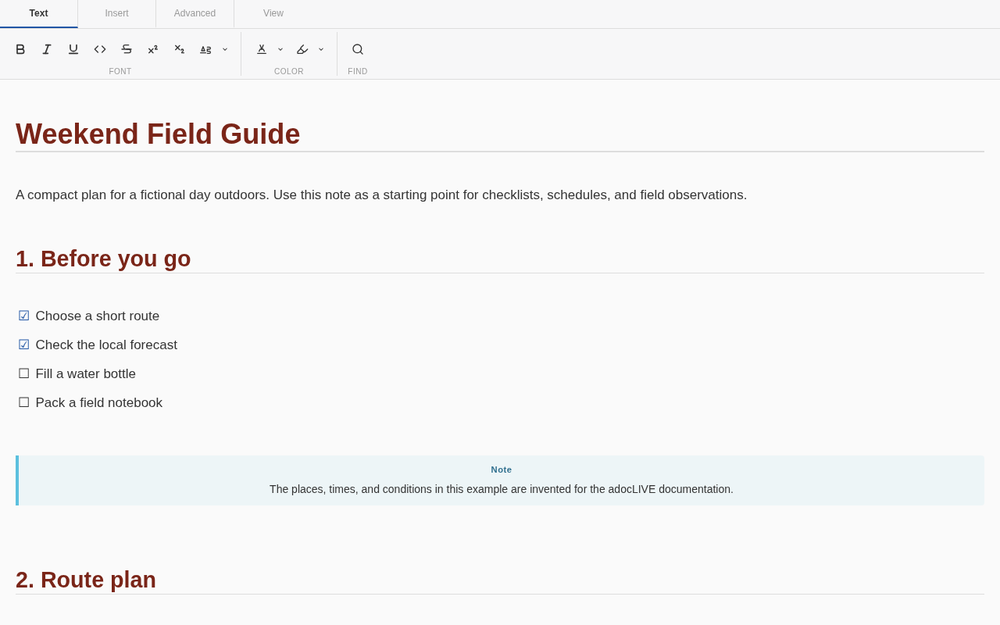
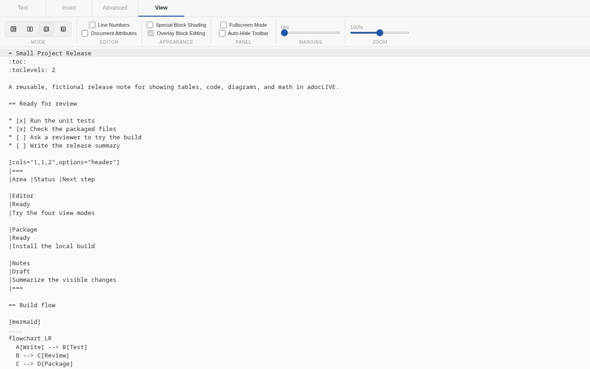
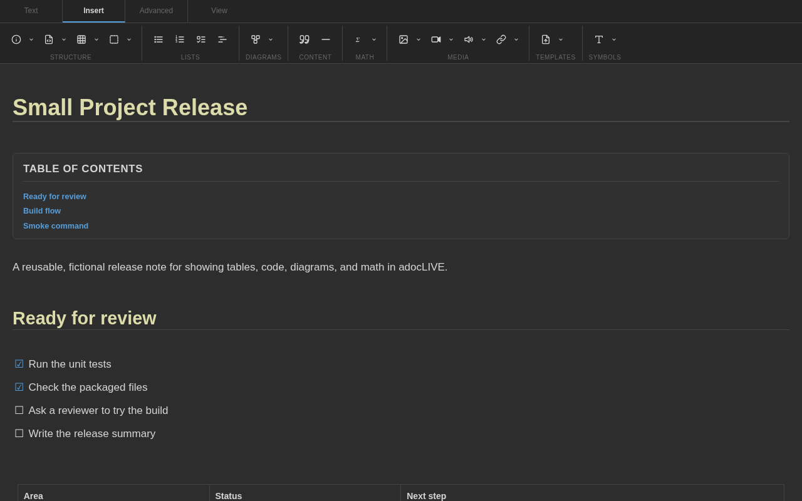

# adocLIVE

adocLIVE is an AsciiDoc editor for Joplin desktop. It adds a ribbon toolbar and four editing views, with headings, lists, tables, code, math, diagrams, and links rendered as you write.

Use it for notes already written in AsciiDoc, convert Markdown notes, or create a new adocLIVE note from Joplin's Tools menu.



Requires Joplin 3.1 or newer on desktop.

## What you can do

- Write in Live Preview, Split View, Raw Text, or Rendered Preview.
- Add common AsciiDoc structures from the Text, Insert, Advanced, and View toolbar tabs.
- Edit rendered tables, code blocks, diagrams, media, quotes, and other blocks.
- Render Mermaid diagrams and KaTeX math inside the note editor.
- Link to Joplin notes and sections with autocomplete.
- Expand supported Joplin note and resource includes in rendered views.
- Convert Markdown notes and pasted Markdown to AsciiDoc.
- Save reusable note templates and short text snippets.

## Install

1. Open **Tools > Options > Plugins** on Windows and Linux, or **Joplin > Settings > Plugins** on macOS.
2. Search for **adocLIVE**.
3. Select **Install**, then restart Joplin.

For a manual installation, download the `.jpl` file from the [latest GitHub release](https://github.com/amalghosh999/adocLIVE-Joplin-Plugin/releases/latest). In Joplin's Plugins screen, open the gear menu and choose **Install from file**.

## Your first adocLIVE note

Choose **Tools > New adocLIVE Note**, then try this:

```asciidoc
= Weekend Field Guide

== Before you go

* [x] Choose a route
* [ ] Fill a water bottle
* [ ] Pack a field notebook

TIP: Keep the first trip simple.
```

You can also convert the current Markdown note with **Tools > Convert to adocLIVE Note**. The note list and notebook context menus include copy and in-place conversion commands.

## Editor views

| View | Best for |
| --- | --- |
| Live Preview | Writing with formatting rendered in place |
| Split View | Comparing AsciiDoc source with Asciidoctor output |
| Raw Text | Working directly with the full source |
| Rendered Preview | Reading the finished document |

The View tab also controls line numbers, document attributes, block shading, overlay editing, content margins, zoom, and fullscreen mode.

## More views





## Examples

The repository includes two ready-to-copy notes:

- [Weekend Field Guide](examples/weekend-field-guide.adoc) shows checklists, an admonition, a table, and basic inline formatting.
- [Small Project Release](examples/small-project-release.adoc) shows a status table, source code, a Mermaid diagram, and math.

Every example and screenshot uses synthetic content created for this project. No personal Joplin notes were used.

## Compatibility

- Joplin 3.1 or newer
- Windows, macOS, and Linux desktop
- Plugin ID: `com.asciidoc.joplin-plugin`
- Package: `joplin-plugin-adoclive`

## Guides and support

- [Full user and contributor guide](https://github.com/amalghosh999/adocLIVE-Joplin-Plugin/blob/master/docs/USER_GUIDE.adoc)
- [Test Lab guide](https://github.com/amalghosh999/adocLIVE-Joplin-Plugin/blob/master/docs/test-lab/README.md)
- [Report a bug or request a feature](https://github.com/amalghosh999/adocLIVE-Joplin-Plugin/issues)
- [Release downloads](https://github.com/amalghosh999/adocLIVE-Joplin-Plugin/releases)

## License

[MIT](LICENSE)
